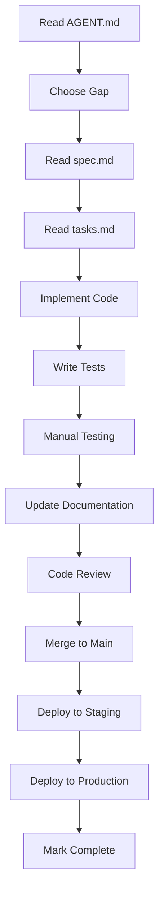

# AI Agent Implementation Plan - Summary

**Date**: August 16, 2025  
**Status**: READY FOR AI AGENT IMPLEMENTATION

---

## Quick Start for AI Agents

This directory contains implementation specifications for completing the WhatsApp Multi-Instance Service. Follow these steps:

1. **Read AGENT.md** - Complete product plan with checklist
2. **Choose a gap** - Start with Priority 1 (Security & Operations)
3. **Read the spec** - Each gap has detailed `spec.md`
4. **Follow tasks.md** - Step-by-step implementation checklist
5. **Implement** - Write code, tests, and documentation
6. **Update status** - Mark completed tasks

---

## Available Specifications

### Priority 1: Security & Operations (CRITICAL)

| Gap | Status | Effort | Files |
|-----|--------|--------|-------|
| **01-Operator Permissions** | ✅ COMPLETE (archived) | 2-3 days | [`spec.md`](../../../archive/operator-permissions-completed/spec.md), [`tasks.md`](../../../archive/operator-permissions-completed/tasks.md) |
| **02-API Key Lifecycle** | 📝 TODO | 3-4 days | _Creating spec..._ |
| **03-PII Redaction** | 📝 TODO | 2 days | _Creating spec..._ |
| **04-Audit Logging** | 📝 TODO | 3 days | _Creating spec..._ |

### Priority 2: Reliability & Observability (HIGH)

| Gap | Status | Effort | Files |
|-----|--------|--------|-------|
| **05-Dead Letter Queue** | 📝 TODO | 3-4 days | _Creating spec..._ |
| **06-Health Endpoints** | 📝 TODO | 1 day | _Creating spec..._ |
| **07-Bot Lock Eviction** | 📝 TODO | 2 days | _Creating spec..._ |
| **08-Streaming Uploads** | 📝 TODO | 3 days | _Creating spec..._ |
| **09-Rate Limiting** | 📝 TODO | 2 days | _Creating spec..._ |

### Priority 3: Integrations (MEDIUM)

| Gap | Status | Effort | Files |
|-----|--------|--------|-------|
| **10-Webhooks** | 📝 TODO | 4-5 days | _Creating spec..._ |
| **11-WhatsApp Cloud API** | 📝 TODO | 5-7 days | _Creating spec..._ |
| **12-AI Summarization** | 📝 TODO | 3-4 days | _Creating spec..._ |

### Priority 4: Testing & CI/CD (MEDIUM)

| Gap | Status | Effort | Files |
|-----|--------|--------|-------|
| **13-Integration Tests** | 📝 TODO | 3 days | _Creating spec..._ |
| **14-E2E Tests** | 📝 TODO | 4 days | _Creating spec..._ |
| **15-Load Tests** | 📝 TODO | 3 days | _Creating spec..._ |
| **16-CI/CD Pipeline** | 📝 TODO | 2 days | _Creating spec..._ |

---

## Implementation Status

### Completed ✅

- ✅ Master specification created
- ✅ Gap identification complete
- ✅ Priority 1, Gap 1 spec created (Operator Permissions)
- ✅ Task checklist created for Gap 1
- ✅ **Gap 01 (Operator Permissions) IMPLEMENTED** — migrations, permission core,
  middleware, storage audit, dashboard wiring, and tests
- ✅ `openspec/changes/manual-onboarding-whatsapp` archived to
  `openspec/archive/manual-onboarding-whatsapp-completed/`

### In Progress 🔄

- 🔄 Gap 2-16 specifications being created

### Next Up 📋

1. **API Key Lifecycle Management** - Critical for production security
2. **PII Redaction** - Required for compliance
3. **Audit Logging** - Security and compliance

---

## Key Documents

| Document | Purpose | Location |
|----------|---------|----------|
| **AGENT.md** | Complete product plan with checklist | `../../../AGENT.md` |
| **README.md** | This summary - getting started guide | `./README.md` |
| **Master Spec** | Complete system architecture | [`../whatsapp-multi-instance-master/master-specification.md`](../whatsapp-multi-instance-master/master-specification.md) |
| **Gap Specs** | Detailed implementation specs | `./specs/XX-*/spec.md` |
| **Task Lists** | Step-by-step checklists | `./specs/XX-*/tasks.md` |

---

## Agent Roles

### Backend Specialist

**Skills Needed**:
- Go programming
- PostgreSQL
- REST API design
- Security best practices

**Suitable Gaps**:
- 01: Operator Permissions
- 02: API Key Lifecycle
- 03: PII Redaction
- 04: Audit Logging
- 05: Dead Letter Queue
- 06: Health Endpoints
- 07: Bot Lock Eviction
- 08: Streaming Uploads
- 09: Rate Limiting

### Frontend Specialist

**Skills Needed**:
- React + TypeScript
- TanStack Router & Query
- Tailwind CSS
- Component testing

**Suitable Gaps**:
- 02: API Keys UI (part of API Key Lifecycle)
- 04: Audit Log UI (part of Audit Logging)
- 14: E2E Tests

### DevOps Specialist

**Skills Needed**:
- Docker & Docker Compose
- CI/CD (GitHub Actions)
- Monitoring & Alerting
- Kubernetes (optional)

**Suitable Gaps**:
- 06: Health Endpoints (deployment config)
- 15: Load Tests
- 16: CI/CD Pipeline

---

## Implementation Workflow

---

## Quality Standards

### Code Quality

- ✅ Follow existing code style
- ✅ Write comprehensive tests (unit + integration)
- ✅ Document public APIs
- ✅ Use structured logging
- ✅ Handle errors gracefully
- ✅ No breaking changes to existing APIs

### Security

- ✅ Validate all inputs
- ✅ Use parameterized queries
- ✅ Hash sensitive data
- ✅ Implement proper authorization
- ✅ Log security events
- ✅ Fail closed on errors

### Testing

- ✅ Unit tests for business logic
- ✅ Integration tests for database interactions
- ✅ E2E tests for critical user flows
- ✅ Load tests for performance-critical paths
- ✅ Minimum 80% code coverage

### Documentation

- ✅ Update API documentation
- ✅ Add migration notes
- ✅ Update AGENT.md checklist
- ✅ Add usage examples
- ✅ Document edge cases

---

## Getting Help

### Questions?

1. Check the specification (`spec.md`)
2. Review the task checklist (`tasks.md`)
3. Read related specifications
4. Check AGENT.md for product context
5. Review master specification for architecture

### Common Issues

**Migration fails**: Check PostgreSQL version, existing constraints
**Tests fail**: Verify test database setup, check dependencies
**Permission denied**: Ensure middleware is applied correctly
**Performance issues**: Profile code, check database indexes

---

## Success Metrics

### Individual Gap Completion

- All tests passing ✅
- Code review approved ✅
- Deployed to production ✅
- No regressions ✅
- Documentation updated ✅

### Overall Project Completion

- Priority 1 gaps complete: 0/4 (0%)
- Priority 2 gaps complete: 0/5 (0%)
- Priority 3 gaps complete: 0/3 (0%)
- Priority 4 gaps complete: 0/4 (0%)

**Target**: All Priority 1-2 gaps complete within 3 weeks

---

## Next Steps

1. **Start with Gap 01** (Operator Permissions) - Most critical for security
2. **Create remaining specs** - Gaps 02-16 specifications
3. **Track progress** - Update this README as gaps are completed
4. **Archive completed specs** - Move to archive when production-ready

---

**Next up?** Create [`specs/02-api-key-lifecycle/spec.md`](./specs/02-api-key-lifecycle/spec.md).
Gap 01 is complete and archived at
[`../../../archive/operator-permissions-completed/spec.md`](../../../archive/operator-permissions-completed/spec.md).
